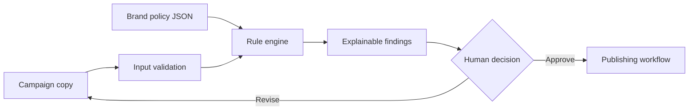

# Campaign Content QA

An explainable preflight checker for marketing content. It reviews copy against configurable brand, claims, readability, channel, and call-to-action rules before a person approves publication.

## Business value

Marketing teams lose time to repetitive reviews and avoidable revision cycles. This tool turns common review standards into visible, testable checks while keeping final editorial judgment with the team.

## Capabilities

- Reviews email, social, landing-page, and ad copy
- Flags prohibited phrases and unsupported absolute claims
- Checks required disclosures and calls to action
- Validates channel length limits
- Returns severity, evidence, and a recommended correction
- Produces a publish recommendation without editing or publishing content

## Architecture



## Quick start

Requires Python 3.11+ and has no external dependencies.

```bash
python campaign_qa.py demo/campaign.json --policy demo/policy.json
python -m unittest discover -s tests -v
```

## Example output

```json
{
  "status": "revise",
  "score": 0,
  "finding_count": 6
}
```

Every finding also contains the rule ID, severity, evidence, and recommended correction.

## Production considerations

- Version policies and record which version approved each asset.
- Separate hard compliance rules from brand-style suggestions.
- Require human approval before publishing.
- Evaluate false positives with a representative, approved content set.
- Restrict customer data and unreleased campaign details.

## Screenshot placeholders

Add screenshots showing the synthetic input, finding list, and revised copy comparison in `docs/screenshots/`.

## License

MIT
